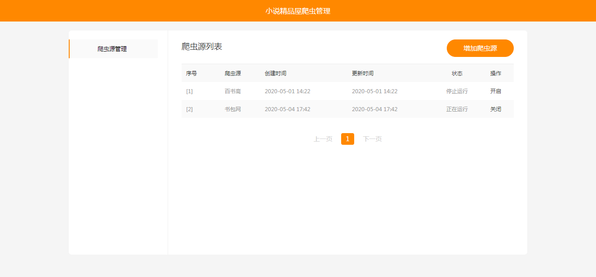

[](https://cloud.tencent.com/act/cps/redirect?redirect=1052&cps_key=736e609d66e0ac4e57813316cec6fd0b&from=console)

# 小说精品屋-plus

#### 演示地址

[点击前往](http://www.java2nb.com)（前台门户）

#### 前言

小说精品屋-plus致力于打造一个完整的商用小说门户平台，使用前建议先阅读此文档。

#### 项目介绍

[小说精品屋](https://github.com/201206030/fiction_house)是一个多平台（web、安卓app、微信小程序）、功能完善的小说弹幕网站，包含精品小说专区、轻小说专区和漫画专区。包括小说/漫画分类、小说/漫画搜索、小说/漫画排行、完本小说/漫画、小说/漫画评分、小说/漫画在线阅读、小说/漫画书架、小说/漫画阅读记录、小说下载、小说弹幕、小说/漫画自动爬取、小说内容自动分享到微博、邮件自动推广、链接自动推送到百度搜索引擎等功能。包含电脑端、移动端、微信小程序等多个平台，现已开源web端、安卓端、小程序端源码。 

小说精品屋-plus是在小说精品屋的基础上，重新进行了数据库设计、代码重构和功能增强，提升了程序整体的可读性和性能，增加了很多商用特性。主要升级如下：

- [x] 数据库重新设计，结构调整。
- [x] 服务端代码重构，MyBatis3升级为MyBatis3DynamicSql。
- [x] 移动站与PC站站点分离，浏览器自动识别跳转。
- [x] PC站UI更新。
- [x] 新闻模块。
- [x] 排行榜。
- [x] 小说评论模块。
- [x] 阅读主题模块。
- [x] 作家专区。
- [x] 充值。
- [x] 后台管理系统。
- [x] 爬虫管理系统。

#### 项目结构

```
novel-plus -- 父工程
├── novel-common -- 通用模块
├── novel-front -- 前台门户系统
├── novel-crawl -- 爬虫管理系统
└── novel-admin -- 后台管理系统
```

#### 技术选型
Springboot+Mybatis+Mysql+Ehcache+Thymeleaf+Layui

#### PC站截图


#### 手机站截图

1. 首页

   

   

2. 小说详情页

   

   

3. 目录页

   

4. 小说阅读页

   

   

#### 爬虫管理系统截图




#### 安装步骤

##### 数据库安装：

1. 安装MySQL软件。
2. 修改MySQL`max_allowed_packet `配置（建议100M）。
3. 新建数据库，设置编码为utf8mb4。
4. 执行sql/novel_plus.sql脚本文件。

##### 爬虫管理系统安装：

1.  修改novel-common模块下application-dev.yml文件中的数据库的配置。
2. 修改novel-crawl模块下application.yml文件中的管理员账号密码。
3. 启动程序，打开浏览器，默认8081端口访问。
4. 选择已有或新增爬虫源（支持自定义爬虫规则），点击`开启`按钮，开始爬取小说数据。

##### 前台小说门户安装：

1. 修改novel-common模块下application-dev.yml文件中的数据库的配置。
2. 启动程序，打开浏览器，默认8080端口访问。

**喜欢此项目的可以给我的GitHub和Gitee加个Star支持一下 。**

#### 其他安装教程

包安装教程：[点击前往](https://my.oschina.net/java2nb/blog/4272630) 

宝塔安装教程（非官方）：[点击前往](https://www.daniao.org/9166.html) 

docker安装教程：[点击前往](https://my.oschina.net/java2nb/blog/4271989)

#### 代码仓库

 Gitee仓库地址： https://gitee.com/xiongxyang/novel-plus

 GitHub仓库地址： https://github.com/201206030/novel-plus 

#### QQ交流群


#### 捐赠支持

开源项目不易，若此项目能得到你的青睐，可以捐赠支持作者持续开发与维护。 


#### 备注

精品小说屋所有相关项目均已在开源中国公开，感兴趣的可进入[开源中国](https://www.oschina.net/p/fiction_house)按关键字`精品小说屋`搜索。

[](https://www.aliyun.com/minisite/goods?userCode=uf4nasee )