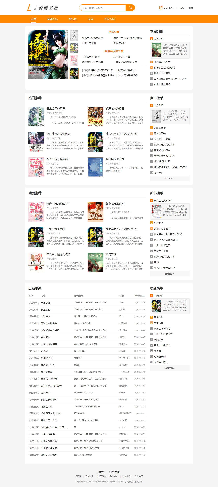
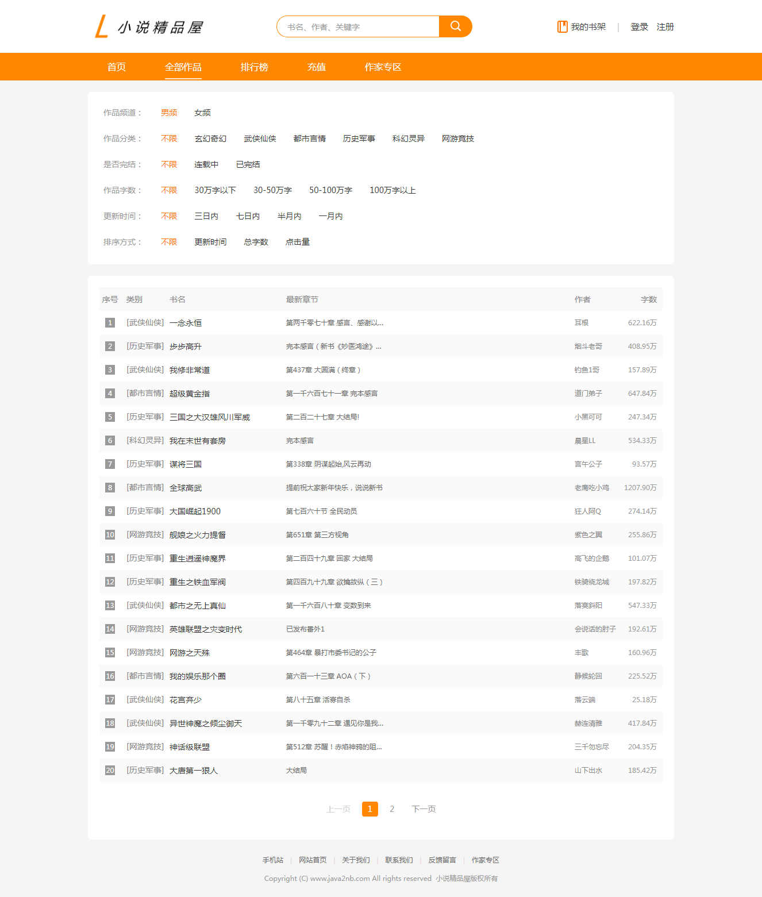
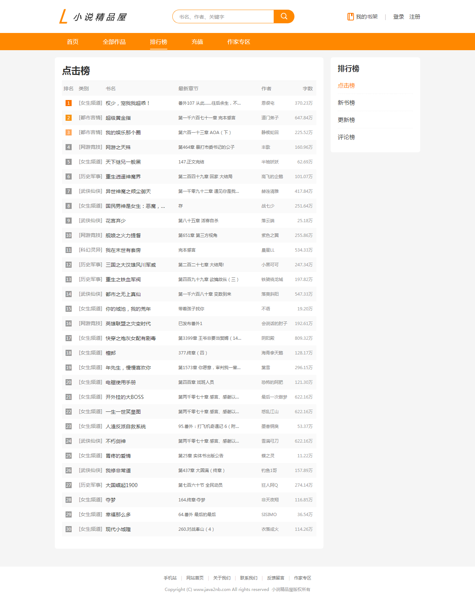
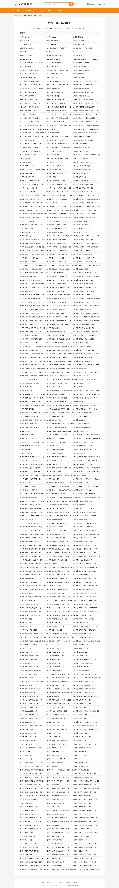
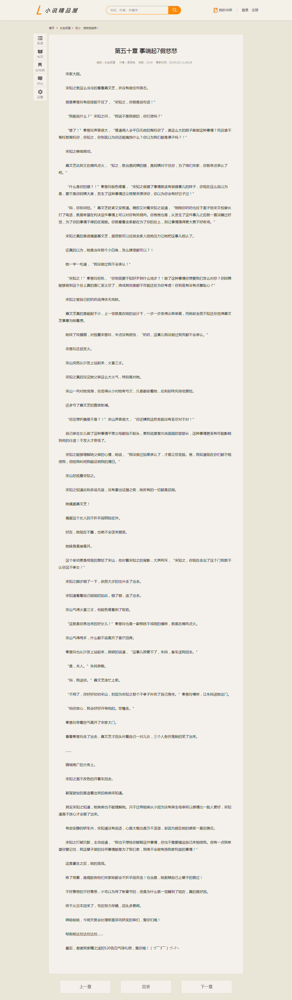
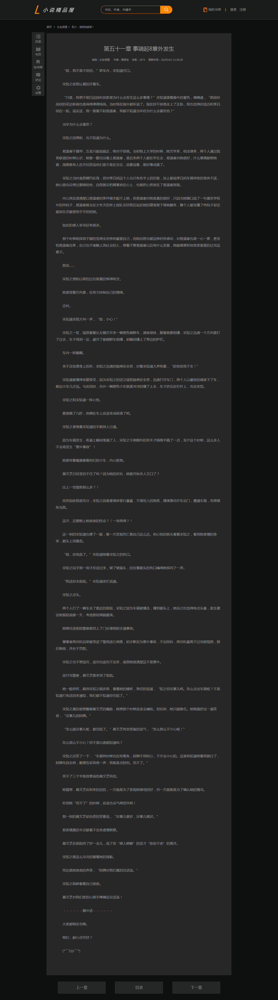

[](https://cloud.tencent.com/act/cps/redirect?redirect=1052&cps_key=736e609d66e0ac4e57813316cec6fd0b&from=console)

# 小说精品屋-plus

#### 前言

小说精品屋-plus致力于打造一个完整的商用小说门户平台。

#### 项目介绍

小说精品屋是一个多平台（web、安卓app、微信小程序）、功能完善的小说弹幕网站，包含精品小说专区、轻小说专区和漫画专区。包括小说/漫画分类、小说/漫画搜索、小说/漫画排行、完本小说/漫画、小说/漫画评分、小说/漫画在线阅读、小说/漫画书架、小说/漫画阅读记录、小说下载、小说弹幕、小说/漫画自动爬取、小说内容自动分享到微博、邮件自动推广、链接自动推送到百度搜索引擎等功能。包含电脑端、移动端、微信小程序等多个平台，现已开源web端、安卓端、小程序端源码。 

小说精品屋-plus是在小说精品屋的基础上，重新进行了数据库设计、代码重构和功能增强，提升了程序整体的可读性和性能，增加了很多商用特性。主要升级如下：

- [x] 数据库重新设计，结构调整。
- [x] 服务端代码重构，MyBatis3升级为MyBatis3DynamicSql。
- [x] 移动站与PC站站点分离，浏览器自动识别跳转。
- [x] PC站UI更新。
- [x] 新闻模块。
- [x] 排行榜。
- [x] 小说评论模块。
- [x] 阅读主题模块。
- [ ] 作家专区。
- [ ] 充值。
- [ ] 后台管理系统。
- [x] 爬虫管理系统。

#### 项目结构

```
novel-plus -- 父工程
├── novel-common -- 通用模块
├── novel-front -- 前台门户系统
├── novel-crawl -- 爬虫管理系统
└── novel-admin -- 后台管理系统
```

#### 技术选型
Springboot+Mybatis+Mysql+Ehcache+Thymeleaf+Layui

#### PC站截图

1. 首页



2.列表页



3.排行页



4.详情页


5.目录页



6.内容页





#### 手机站截图

1. 首页

   

   

2. 小说详情页

   

   

3. 目录页

   

4. 小说阅读页

   

   

#### 爬虫管理系统截图


**喜欢此项目的可以给我的GitHub和Gitee加个Star支持一下 。**

#### 演示地址

[点击前往](http://www.java2nb.com)（前台门户）

#### 代码仓库

 Gitee仓库地址： https://gitee.com/xiongxyang/novel-plus

 GitHub仓库地址：  https://github.com/201206030/fiction_house 

#### QQ交流群


#### 捐赠支持

开源项目不易，若此项目能得到你的青睐，可以捐赠支持作者持续开发与维护。 


##### 捐赠名单 

| 捐赠者 | 金额     | 时间                        |
| :----- | :------- | :-------------------------- |
| **阳   | ￥10.00  | 2020年03月06日 下午14点10分 |
| *梦    | ￥66.00  | 2019年12月27日 下午21点39分 |
| *金名  | ￥50.00  | 2019年12月27日 下午19点29分 |
| *天气  | ￥300.00 | 2019年12月27日 上午10点13分 |
| *强    | ￥10.00  | 2019年12月25日 下午21点29分 |
| *生    | ￥50.00  | 2019年12月25日 下午18点36分 |
| *江云  | ￥100.00 | 2019年12月20日 下午19点57分 |
| *磊    | ￥3.00   | 2019年12月17日 下午18点09分 |
| *勇    | ￥20.00  | 2019年11月30日 下午16点13分 |
| *伟    | ￥10.00  | 2019年11月14日 上午11点02分 |
| *式    | ￥8.88   | 2019年11月12日 下午23点54分 |
| *星    | ￥20.00  | 2019年11月12日 下午20点11分 |
| *😊     | ￥100.00 | 2019年11月12日 下午15点32分 |
| *东    | ￥10.00  | 2019年11月11日 下午21点23分 |
| *海    | ￥15.00  | 2019年11月11日 上午7点45分  |
| *飞    | ￥5.00   | 2019年11月11日 上午0点14分  |
| *沐    | ￥10.00  | 2019年11月10日 上午12点09分 |

#### 备注

精品小说屋所有相关项目均已在开源中国公开，感兴趣的可进入[开源中国](https://www.oschina.net/p/fiction_house)按关键字`精品小说屋`搜索。

[](https://www.aliyun.com/minisite/goods?userCode=uf4nasee )